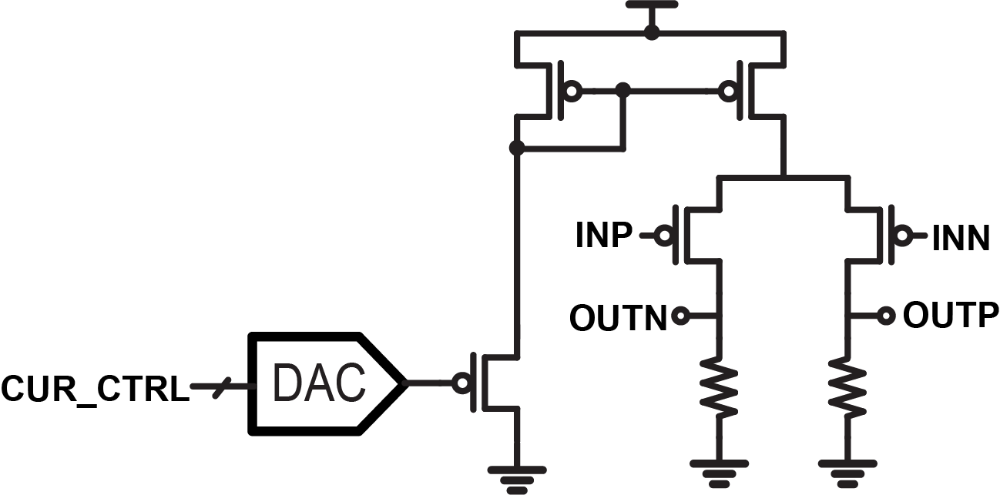

# LVDS Driver

LVDS driver with current generator, CML driver and ESD diodes.
Current is generated with a voltage DAC and source follower.

NOTES: the driver only have 

## Input/Output

    Inputs:
     - cur_ctrl: current control through a voltage DAC (default value 32)
     - inp/inn: data input
     - VDD: supply (0.9V)
     - VSS: ground
     
    Output:
     - outp/outn: data output
     
## Architecture
    
   
    

## Simulation results

The LVDS driver is simulated with 200Mbps input and 100fF load. The output eyediagram diagram is 

